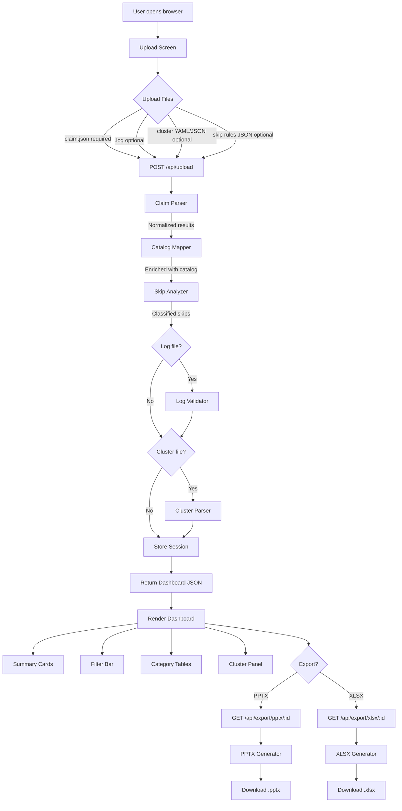
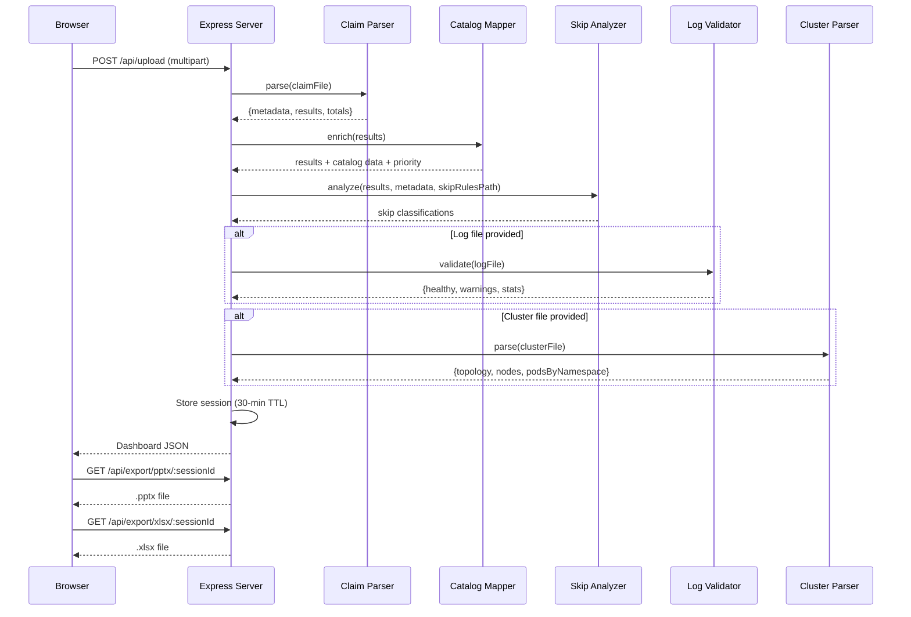
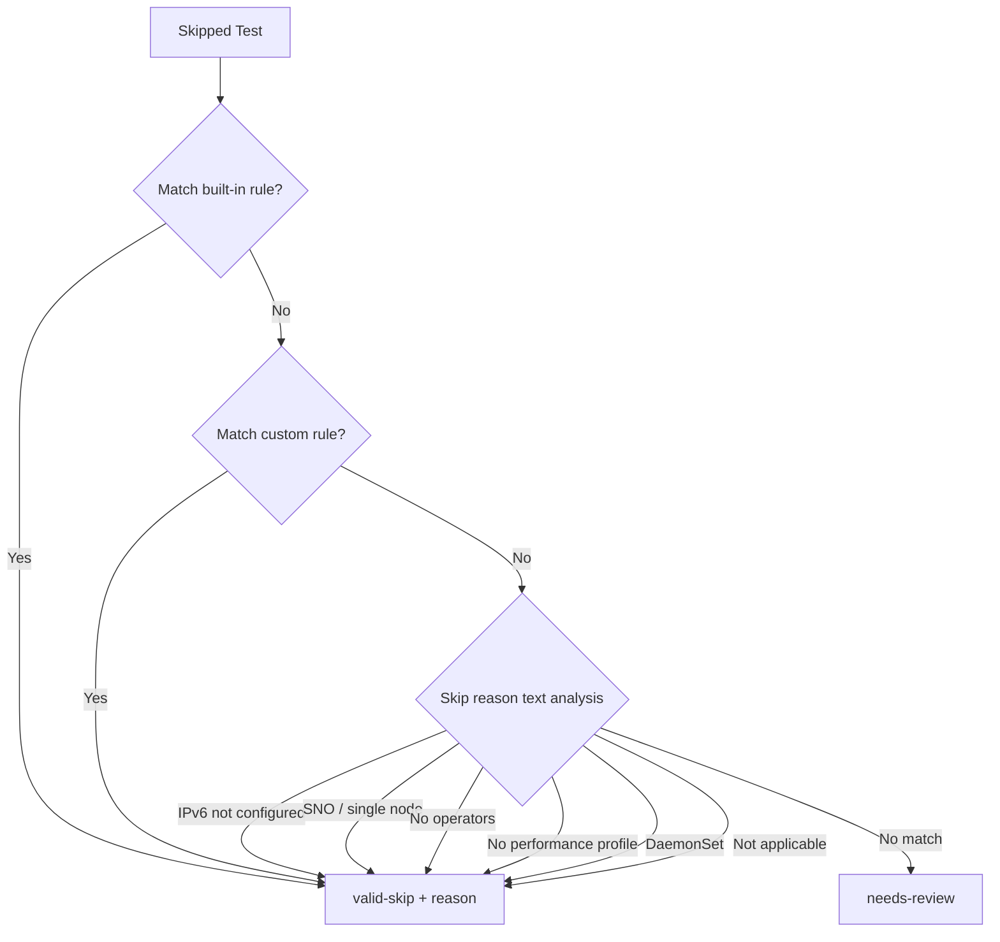

# Process Flow

## Architecture Overview



## Server Processing Pipeline



## Dashboard Layout

```
+------------------------------------------------------------------+
|  Header: CNF version | OCP version | Certsuite | Run timestamp   |
+------------------------------------------------------------------+
|  [!] Log Health Warning Banner (if issues detected)              |
+------------------------------------------------------------------+
|  [Download PPTX]  [Download Excel]                               |
+----------+-------------------------------------------------------+
|          |  [Total: 119] [Passed: 82] [Failed: 21] [Skipped: 16] |
| Cluster  |-------------------------------------------------------|
| Panel    |  Category: [All v]  Scenario: [All v]  Status: [x][x]  |
|          |-------------------------------------------------------|
| Topology |  Category Summary Table                                |
| 3CP + 3W |  Suite | Total | Passed | Failed | Skipped            |
|          |-------------------------------------------------------|
| Pods:    |  Access Control (collapsible)                          |
| ns/pod   |    Test ID | Status | Description | Details | Priority |
| [YAML]   |  Lifecycle (collapsible)                               |
|          |    ...                                                 |
+----------+-------------------------------------------------------+
```

## Skip Analysis Decision Tree


